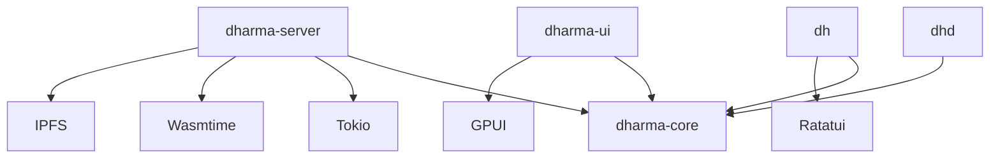

# DHARMA Artifacts & Binaries

The DHARMA ecosystem produces four distinct binaries, each targeting a specific operational profile.

---

## 1. `dhd` (The Embedded Kernel)
The "Minimum Viable Truth." Designed for constrained environments.

-   **Size Target:** < 1MB (Stripped).
-   **Dependencies:** `std` only. No `tokio`, no `wasmtime`, no `libp2p`.
-   **Runtime:** Single-threaded or Thread-per-Core. Blocking IO.
-   **Wasm:** `wasmi` (Interpreter).
-   **Use Case:** IoT Sensors, Raspberry Pi, Mobile Library, "Git-like" local usage.

## 2. `dharma-server` (The Enterprise Node)
The "Hub." Designed for high-throughput, always-on infrastructure.

-   **Size Target:** 10MB - 50MB.
-   **Dependencies:** `tokio`, `axum`, `metrics`, `ipfs-embed`, `wasmtime`.
-   **Runtime:** Async Actor Model.
-   **Wasm:** `wasmtime` (JIT) for Oracles; `wasmi` for Consensus.
-   **Features:**
    -   Prometheus Metrics (`/metrics`).
    -   HTTP Gateway / GraphQL.
    -   Dioxus Fullstack Server (Web Hosting).
    -   IPFS Blob Store.
-   **Use Case:** Cloud Relay, SaaS Backend, Corporate Gateway.

## 3. `dh` (The CLI)
The "Swiss Army Knife." The primary developer interface.

-   **Size Target:** 2MB - 5MB.
-   **Dependencies:** `clap`, `rustyline`, `inquire`, `ratatui`.
-   **Features:**
    -   `repl`: Interactive Shell.
    -   `test`: Simulation Harness.
    -   `write/query`: Ad-hoc commands.
    -   `pkg`: Package management.
-   **Behavior:** Can run logic internally (ephemeral mode) or connect to a running `dhd`/`dharma-server`.

## 4. `dharma-ui` (The Workspace)
The "Universal App." A high-performance native desktop GUI.

-   **Size Target:** 10MB - 20MB.
-   **Stack:** **GPUI** (Rust native, GPU accelerated).
-   **Philosophy:** "The Emacs of 2030s." 120fps, keyboard-centric, instant.
-   **Features:**
    -   Visual Subject Explorer.
    -   DHL Editor with LSP.
    -   Chat Interface.
    -   Atlas / Router Management.
-   **Use Case:** End-user "Operating System" for DHARMA.

---

## Dependency Graph

