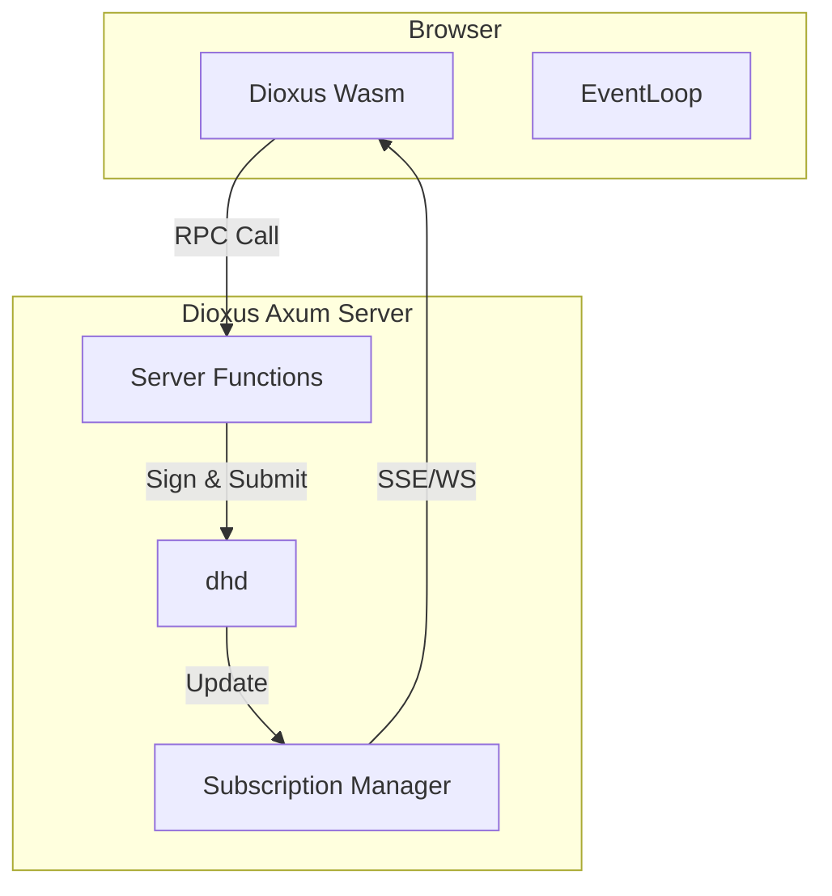

# Task 50: DHARMA-WEB (Dioxus Fullstack)

## Goal
Integrate DHARMA with **Dioxus Fullstack** to enable rapid development of "Server-Hosted" DHARMA applications.
The DHARMA Kernel runs on the server. The Browser interacts via Dioxus Server Functions (RPC) and Server-Sent Events (SSE).

## 1. The Architecture (Fullstack)

## 2. Deliverables

### A. `dharma-dioxus-server` Crate
Middleware to mount DHARMA into the Dioxus Axum server.
-   **State Injection:** Makes `DharmaNode` available to server functions.
-   **Authentication:** Bridges Dioxus Sessions to DHARMA Identity (Delegation).

### B. Code Generation (`dh gen-dioxus`)
A CLI tool to generate Rust code from DHL.
-   **Input:** `blog.dhl`
-   **Output:** `blog.rs` containing:
    -   `struct PageState` (derived from Schema).
    -   `#[server] async fn create_page(...)` (derived from Actions).
    -   `use_page_stream(id)` (Subscription hook).

### C. The Router Bridge
-   Dioxus Router integration that resolves paths against the Server's `std.atlas` registry.
-   Enables `<Route path="/:slug" component={CmsLoader} />`.

### D. Zero-Code App Mode (`dh serve <namespace>`)
The ultimate goal. The server dynamically loads a namespace (e.g. `com.example.blog`) and constructs the entire app at runtime:
1.  **Router:** Derived from the namespace's `std.atlas` registry.
2.  **Views:** Generic Dioxus components render the data based on DHL types (Auto-Admin / Auto-CMS).
3.  **No Rust Code:** The DHL *is* the application definition.

### E. `std.web` Components
-   Pre-built Dioxus components for rendering standard types (`Markdown`, `Image`, `Identity`).

## 3. Success Criteria
-   `dh new --template dioxus-cms` scaffolds a project.
-   `dh serve com.example.blog` serves a working CMS without compiling a custom binary.
-   `cargo run` starts the fullstack app + embedded dhd.
-   Clicking "Save" in the browser triggers a Wasm validation on the server and persists to `log.bin`.
